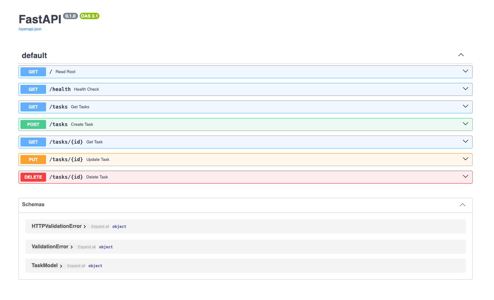

# Task API

A simple RESTful **Task Management API** built with **FastAPI**. The API provides CRUD operations for tasks, along with basic root and health-check endpoints.

Tasks are currently stored **in memory**, so data will be reset whenever the application restarts.

## Features

* Create, read, update, and delete tasks
* Retrieve all tasks or a task by ID
* Health-check endpoint
* HTTP status codes for successful and error responses
* Interactive API documentation with Swagger UI

## Installation & Run

Clone the repository and install the dependencies:

```bash
pip install "fastapi[standard]"
```

Start the development server with:

```bash
fastapi dev main.py
```

The API will be available at:

```text
http://127.0.0.1:8000
```

Swagger documentation:

```text
http://127.0.0.1:8000/docs
```

## API Endpoints

| Method | Endpoint      | Description                                     | Success          |
| ------ | ------------- | ----------------------------------------------- | ---------------- |
| GET    | `/`           | Returns API information and available endpoints | `200 OK`         |
| GET    | `/health`     | Checks API health                               | `200 OK`         |
| GET    | `/tasks`      | Returns all tasks                               | `200 OK`         |
| GET    | `/tasks/{id}` | Returns a task by ID                            | `200 OK`         |
| POST   | `/tasks`      | Creates a new task                              | `201 Created`    |
| PUT    | `/tasks/{id}` | Updates a task by ID                            | `200 OK`         |
| DELETE | `/tasks/{id}` | Deletes a task by ID                            | `204 No Content` |



### Example Task

```json
{
  "id": 1,
  "title": "Task 1",
  "done": true
}
```

## Example Request

### Create a Task

```bash
curl -i -X POST "http://127.0.0.1:8000/tasks" \
  -H "Content-Type: application/json" \
  -d '{"title":"Buy milk"}'
```

Example response:

```text
HTTP/1.1 201 Created
content-type: application/json

{"message":"Created"}
```

## Swagger UI

The API can be explored and tested interactively using FastAPI's automatically generated Swagger UI.


## Project Structure

```text
.
├── main.py
├── README.md
└── images/
    └── swagger.png
```

## Notes

* Tasks are stored in a Python list and are **not persisted in a database**.
* Task IDs are generated using the current list length.
* The API is intended as a simple CRUD API for learning and demonstration purposes.
